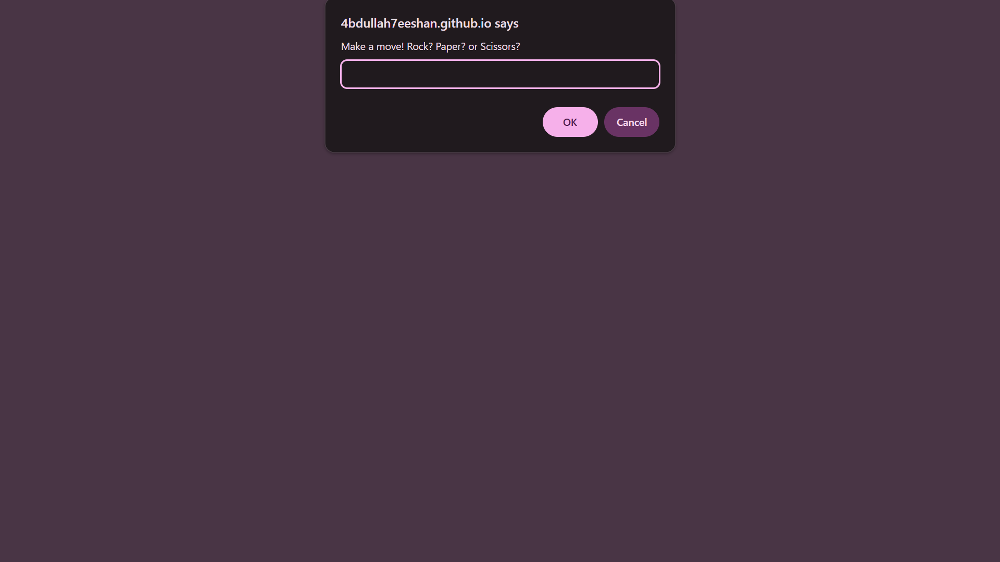
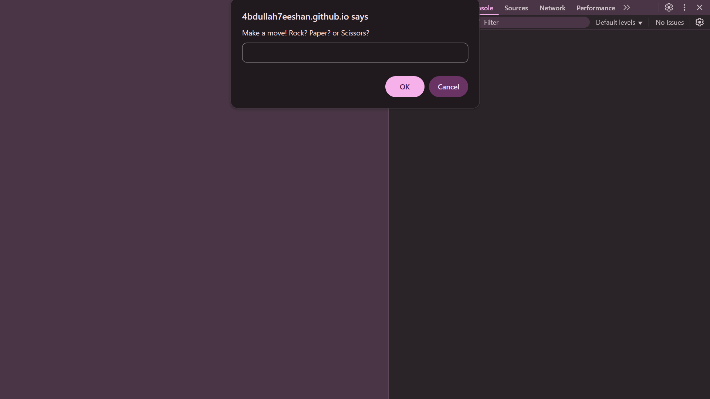
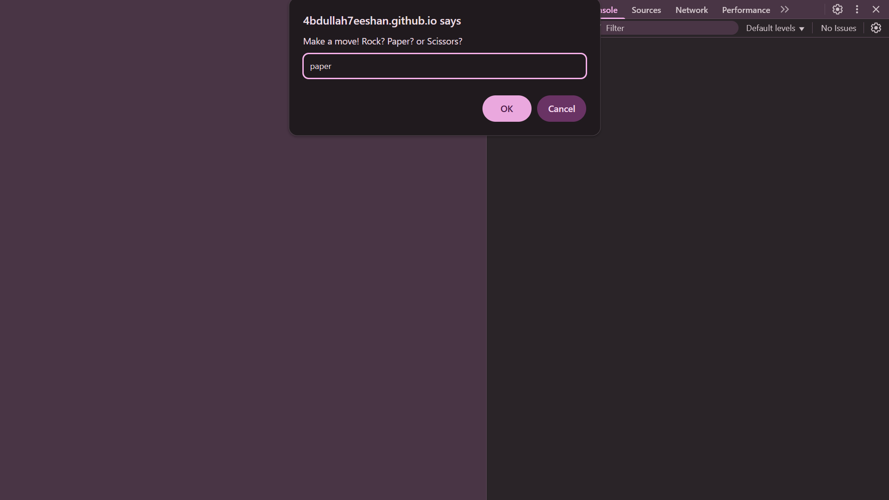
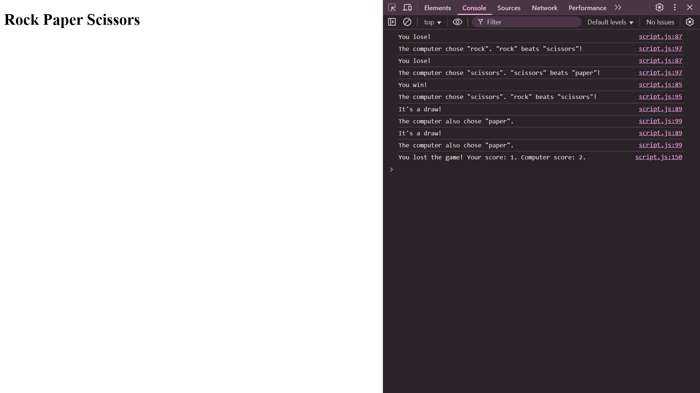

# Rock Paper Scissors

Rock Paper Scissors game created using JavaScript that can be played entirely in the console.

## How to play?

1. Visit the game link: <https://4bdullah7eeshan.github.io/odin-recipes/>



2. Open browser inspector by pressing `F12` to view the console.



3. Make a move by typing *rock*, *paper*, or *scissors*. Your input is case-insensitive, meaning *RocK*, *ROCK*, etc. will work fine.



> Note: Currently, no logic is set to check for validation. It is assumed that you will enter a valid string. Eg. No logic is setup in case you make a move *pumpkin*.

4. Play all rounds. There are a total of 5 rounds. Once they are all done. The game results will be displayed in the console.



5. Refresh the webpage to restart the game.

## Technologies Used

- HTML
- JavaScript

## Project Structure

Here is a bird-eye view of the *core* items of this project:

```
├── README.md
├── index.html
└── js/
    └── script.js
```

## Getting Started

```bash
git clone git@github.com:4bdullah7eeshan/odin-rock-paper-scissors.git
cd odin-rock-paper-scissors
```

## Background

This game was created as part of [The Odin Project](https://www.theodinproject.com/)'s [Rock Paper Scissors](https://www.theodinproject.com/lessons/foundations-rock-paper-scissors) project.

### To Odinites

Thanks for being here :heart: !

This is a revisit to the project as part of my second iteration of the TOP curriculum.

## License

This project is licensed under the Apache License, Version 2.0 (the “License”).

You can do *anything* you want with the code. 

## Notes to self

- Handle score management in a separate function.